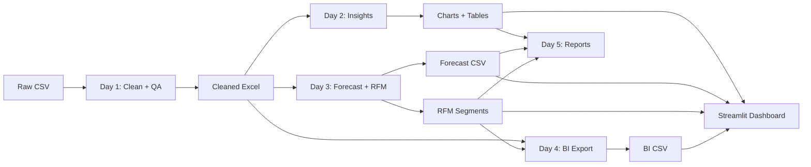

# Superstore Strategy Analysis

A CLI tool and interactive dashboard that analyzes retail sales data, forecasts future trends, and segments customers using Python, Pandas, and Streamlit.

## Demo

```bash
# Full pipeline execution
./start.sh

# Output:
# ╔══════════════════════════════════════════════════════════════╗
# ║     Superstore Strategy Analysis Pipeline                    ║
# ║     Clean → Insights → Forecast → RFM → BI → Dashboard       ║
# ╚══════════════════════════════════════════════════════════════╝
#
# [DONE] Day 1 cleaning complete.
# [DONE] Wrote outputs/day2_insights.md
# [DONE] Day 3 outputs generated.
# [DONE] Wrote outputs/bi/superstore_bi.csv
# [DONE] Day 5 generated: executive summary + slide outline + talk track.
# ✓ Total execution time: 15s
```

## Features

### Implemented (v1.0)
- **Data Cleaning**: Schema-flexible CSV cleaning with derived fields (Year, Month, Ship Days)
- **QA Reports**: Duplicate detection, blank counts, profit margin calculations
- **Sales Insights**: Monthly trends, YoY growth, Region/Segment/Category breakdowns
- **Visualization**: Matplotlib charts (PNG) and Plotly interactive charts (dashboard)
- **Forecasting**: 5 models with rolling backtest selection (MAPE ~21%)
- **RFM Segmentation**: Recency, Frequency, Monetary scoring with 6 customer segments
- **BI Export**: Flattened CSV for Power BI with customer segments joined
- **Executive Reports**: Markdown summaries, slide outlines, talk tracks
- **Interactive Dashboard**: Streamlit app with 5 pages and data filtering

### Planned (v2.0)
- [PLACEHOLDER] Confidence intervals for forecasts
- [PLACEHOLDER] Automated email reports
- [PLACEHOLDER] REST API for real-time predictions
- [PLACEHOLDER] Multi-dataset comparison

## Architecture

5-day pipeline (Day 1-5) processes raw CSV through cleaning, insights, forecasting, and reporting. Streamlit dashboard reads generated artifacts for visualization.



## Setup

### Prerequisites
- Python 3.9+
- pip
- [PLACEHOLDER] Optional: Docker for containerized execution

### Quick Start

```bash
# Clone repository
git clone [PLACEHOLDER_REPO_URL]
cd Superstore-Strategy-Analysis

# Run full pipeline
./start.sh

# Or run specific day
./start.sh day1  # Data cleaning
./start.sh day2  # Insights
./start.sh day3  # Forecast + RFM
./start.sh day4  # BI export
./start.sh day5  # Story pack

# Launch dashboard
./start.sh dashboard

# Pipeline + dashboard
./start.sh full+dashboard
```

### Run Tests

```bash
python -m venv .venv
source .venv/bin/activate
pip install -r requirements.txt
python -m pytest tests/test_pipeline_smoke.py -v
```

### Configuration

No configuration file required. Command-line arguments:

```bash
# Day 1
python src/day1_clean.py --input data_raw/train.csv --output data_clean/Superstore_Cleaned.xlsx

# Day 2
python src/day2_insights.py --input data_clean/Superstore_Cleaned.xlsx

# Day 3
python src/day3_forecast_rfm.py --input data_clean/Superstore_Cleaned.xlsx --horizon 12

# Day 4
python src/day4_export_bi.py --master_xlsx data_clean/Superstore_Cleaned.xlsx \
  --rfm_csv outputs/day3_rfm_segments.csv --out_csv outputs/bi/superstore_bi.csv

# Day 5
python src/day5_story_pack.py --out_exec outputs/day5_executive_summary.md \
  --out_slides docs/day5_slide_outline.md --out_talk docs/day5_talk_track.md
```

## API Reference

N/A

## Data Model / Schema

**Input (Raw CSV)**
| Column | Type | Description |
|--------|------|-------------|
| Row ID | int | Unique row identifier |
| Order ID | string | Order identifier |
| Order Date | date | Order placement date (MM/DD/YYYY) |
| Ship Date | date | Shipping date (MM/DD/YYYY) |
| Ship Mode | string | Shipping method |
| Customer ID | string | Customer identifier |
| Customer Name | string | Customer name |
| Segment | string | Customer segment (Consumer/Corporate/Home Office) |
| Country | string | Country |
| City | string | City |
| State | string | State |
| Postal Code | int | Postal code |
| Region | string | Region (Central/East/South/West) |
| Product ID | string | Product identifier |
| Category | string | Product category (Furniture/Office Supplies/Technology) |
| Sub-Category | string | Product sub-category |
| Product Name | string | Product name |
| Sales | float | Sales amount |

**Derived Fields**
| Column | Type | Description |
|--------|------|-------------|
| Year | int | Order year |
| Month | int | Order month |
| Year-Month | string | YYYY-MM format |
| Ship Days | int | Days between order and ship |

**RFM Output (CSV)**
| Column | Type | Description |
|--------|------|-------------|
| Customer ID | string | Customer identifier |
| RecencyDays | int | Days since last order |
| Frequency | int | Number of orders |
| Monetary | float | Total sales |
| R_Score | int | Recency score (1-5) |
| F_Score | int | Frequency score (1-5) |
| M_Score | int | Monetary score (1-5) |
| RFM_Score | int | Combined RFM score |
| Segment | string | Segment (Champions/Loyal/At Risk/etc) |

## Trade-offs & Design Decisions

- **Chose:** 5 separate day scripts instead of monolithic script
- **Gave up:** Single-file execution simplicity
- **Why:** Modularity allows running individual stages; easier debugging; portfolio showcases incremental analysis workflow

- **Chose:** Excel as intermediate format
- **Gave up:** Pure CSV pipeline (faster, lighter)
- **Why:** Excel preserves data types; portfolio deliverable; multiple sheets (Master + QA)

- **Chose:** Streamlit over Flask/Django for dashboard
- **Gave up:** Custom UI flexibility
- **Why:** Faster development; Python-native; suitable for data exploration tool

## Limitations

- Dataset is synthetic (Tableau Sample Superstore); no real 2019+ data for forecast validation
- Forecast MAPE ~21% (acceptable for baseline, not production-grade)
- Single-threaded execution; no parallel processing for large datasets
- No real-time data ingestion; batch processing only
- No authentication/authorization on dashboard
- Limited to English locale for date parsing

## Next Steps

- [PLACEHOLDER] Add unit tests for individual functions (currently only smoke tests)
- [PLACEHOLDER] Implement confidence intervals for forecasts
- [PLACEHOLDER] Add automated email scheduling for reports
- [PLACEHOLDER] Docker Compose setup with volume mounting for data
- [PLACEHOLDER] Support for multiple currency formats
- [PLACEHOLDER] Export to PowerPoint (python-pptx) for slide generation
